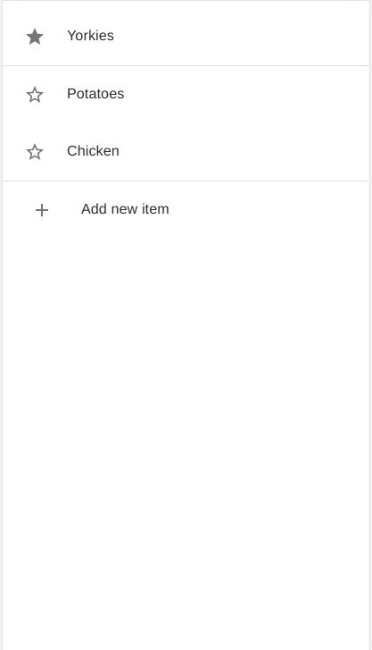
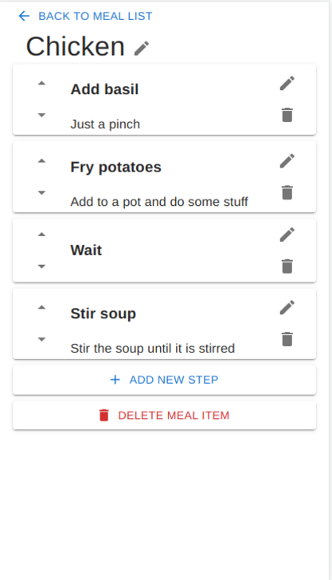

# Meal Planner App

**This project is in very early development**

## What is this project

This project is an app to help plan large meals composed of multiple parts where timing of each part is important.

This app is currently designed for usage on a mobile phone or tablet and the experience may not be optimised for a desktop environment. The UI is also being designed for fast development rather than appearence (for now)

## Development

Common actions have been encapsulated as npm tasks "start" and "test". To run these tasks you will need [npm] (https://nodejs.org/en/).

## Fixes to do

- Fix issues with running tests with kaocha (currently set up to use shadow-cljs test)

## Roadmap

This is a *rough* roadmap of features that are planned and *roughly* when they should be required.
This is very subject to change as priorities change and move around.

### Next

- Ability to add meal items to a meal plan
- Ability to save meal plans
- Ability to run a meal plan
- Ability to tick off steps from a running meal plan

### Next + 1

- Ability to set times against meal steps
- Warning when it is time to perform a meal step
- Indication when a meal step is late
- Use step times to interleave steps in order to perform
- Updating estimated end-time when a meal step is late

### Next + 2

- Ability to set "Serve-by" time and have meal step times calculate backwards to when to begin

### Future

- Add ability to add images and recipe addresses to meal item steps
- Can add equipment and ingredients to steps
- Preparation steps that can be done days before
- Abilitiy to save to remote db (tbd) rather than just local db
- Authentication
- Phone app version
- More desktop friendly UI

## Thanks for the tooling

- [Clojure](https://clojure.org/)
- [Reagent](https://reagent-project.github.io/)
- [Re-Frame](https://day8.github.io/re-frame/)
- [Reagent Material UI](https://github.com/arttuka/reagent-material-ui)